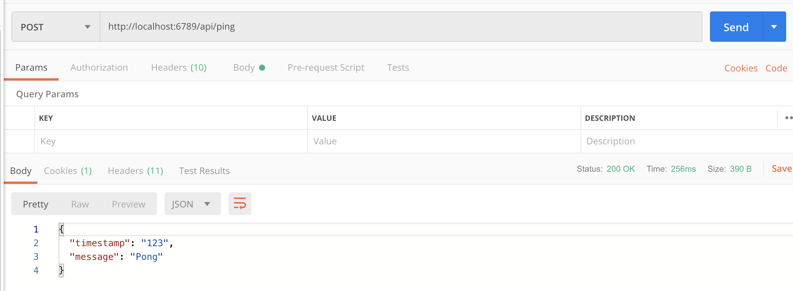

Nếu bạn đã từng xây dựng một ứng dụng với GRpc thì chắc chắn bạn đã biết được những ưu điểm của GRpc là khả năng truyền tải nhanh(lên tới 8 lần) và tối ưu hoá nội dung tin nhắn gửi đi. Nhưng hẳn là bạn cũng biết được khuyết điểm lớn nhất của nó là không phải ứng dụng nào cũng hỗ trợ giao thức GRpc. Ví dụ như browser không thể gọi trực tiếp một service bằng GRpc. Vậy tại sao chúng ta không xây dựng một service mà có thể hỗ trợ API cho GRpc và Http?

## 1. Giới thiệu

[GRpc Gateway](https://github.com/grpc-ecosystem/grpc-gateway) là một giải pháp cho vấn đề này nhưng nó yêu cầu ta phải triển khai một service `side car`. Tôi đã từng thử nó ở thực tế và đã gặp rất nhiều vấn đề xuất hiện với `GRpc Gateway` này như authenticate, streaming data, bảo mật đường truyền, lỗi networking giữa gateway và service,... Lúc này, cách duy nhất để giải quyết vấn đề là ta phải vào thay đổi code của `Grpc Gateway` và không phải ai cũng biết về golang. Bên cạnh, một khuyết điểm của việc sử dụng nó là gói tin sẽ tốn thời gian đi qua thêm một `hop`, điều này cũng ảnh hưởng đến hiệu năng.

Vậy tại sao không tạo một service mà có thể hỗ trợ cả hai loại API này? Với `Spring Boot`, mọi thứ ta cần làm chỉ là cấu hình. Lúc này, service của chúng ta sẽ có cả hai đầu API sử dụng chung `data transfer object` là object được tạo ra từ file `proto`.

Trước khi đến với phần 2, mình hi vọng các bạn đã có kiến thức cơ bản về Spring Boot, GRpc, Protobuf, ...

## 2. Cách thực hiện

Mình sẽ tạo một service Ping Pong hỗ trợ API Http và Grpc. Toàn bộ ví dụ mẫu nằm repository [spring_grpc_http](https://github.com/thinhdanggroup/spring_grpc_http).

### 2.1. Định nghĩa API

Tạo một API proto là Ping theo [định nghĩa](https://github.com/thinhdanggroup/spring_grpc_http/blob/master/core/src/main/proto/ping.proto) sau:

```proto
syntax = "proto3";

// options for Java generated sources
option java_multiple_files = true;
option java_package = "com.thinhda.spring.grpc.core.model";
option java_outer_classname = "CoreGrpcApi";

package sms.core;

message PingRequest {
    int64 timestamp = 1;
}

message PingResponse {
    int64 timestamp = 1;
    string message = 2;
}

service CoreService {
    rpc Ping (PingRequest) returns (PingResponse);
}
```

Sử dụng command `mvn clean install` để tạo các object từ file proto.

### 2.2. Xây dựng GRpc Controller

Sử dụng GRpc thư viện [grpc-spring-boot-starter](https://github.com/LogNet/grpc-spring-boot-starter), đây là thư viện khá hay nếu bạn muốn tạo một `service GRpc`. Ta chỉ cần cấu hình port chạy GRpc và tập trung hiện thực logic mong muốn mà không cần quan tâm về nhiều cách khởi tạo `GRpc Server`. Bên cạnh, thư viện này cũng cung cấp tính năng tạo `interceptor`, ta có thể thêm nhiều lớp interceptor để hỗ trợ logging, authenticate, dịch cách exception sang error code tương ứng để trả về người dùng,...

Thêm cấu hình port vào file `application.yaml` để khởi chạy GRpc service ở port `6790`:

```yaml
grpc:
  port: 6790
```

Bên cạnh, ta cũng cần thêm anotation `@GRpcService` vào class [GrpcController](https://github.com/thinhdanggroup/spring_grpc_http/blob/master/core/src/main/java/com/thinhda/spring/grpc/core/controller/GrpcController.java) để có thể khởi tạo một service GRpc.

### 2.3. Sử dụng protobuf class cho Http Controller

Đây là phần quan trọng nhất để ta có thể sử dụng object được tạo ra từ proto file. Thêm [class config](https://github.com/thinhdanggroup/spring_grpc_http/blob/master/core/src/main/java/com/thinhda/spring/grpc/core/config/ApiConfig.java) cấu hình sau

```java
package com.thinhda.spring.grpc.core.config;

import lombok.Data;
import org.springframework.context.annotation.Bean;
import org.springframework.context.annotation.Configuration;
import org.springframework.http.converter.protobuf.ProtobufJsonFormatHttpMessageConverter;
import org.springframework.web.filter.CommonsRequestLoggingFilter;

@Data
@Configuration
public class ApiConfig {

    @Bean
    public ProtobufJsonFormatHttpMessageConverter protobufHttpMessageConverter() {
        return new ProtobufJsonFormatHttpMessageConverter();
    }

}
```

Phương pháp decode mặc định của Spring không hỗ trợ format và decode `object` được tạo ra từ file proto. Nhưng ta có thể thay đổi cách format này bằng cách cung cấp cho Spring một bean là `ProtobufJsonFormatHttpMessageConverter`.


### 2.4 Kiểm tra

Sử dụng [BloomGRpc](https://github.com/uw-labs/bloomrpc) (công cụ để gọi Api của GRpc) để kiểm tra GRpc API:


Kiểm tra Http Api với Postman:



## Kết luận

Một service cung cấp cả hai đầu API Http và GRpc mang lại rất nhiều lợi ích khi hệ thống khác muốn tích hợp với service của bạn, vừa cung cấp tốc độ truyền tải nhanh và nhẹ nhờ giao tiếp qua GRpc và cũng có thể giao tiếp một cách đơn giản hơn qua giao thức Http truyền thống.
